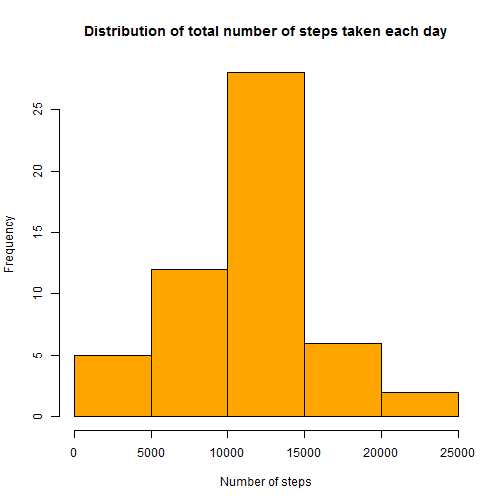
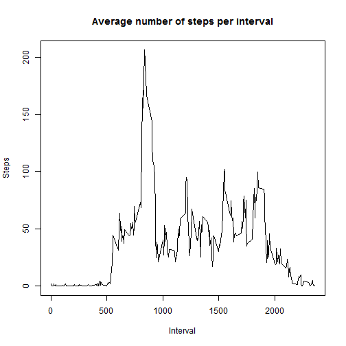
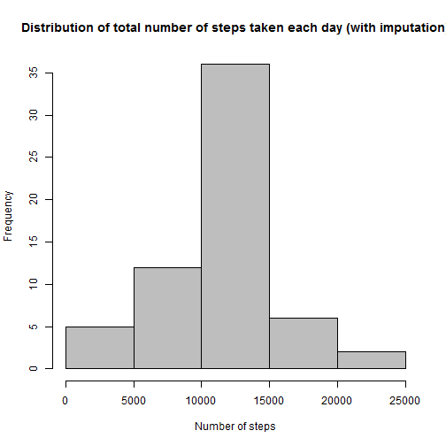
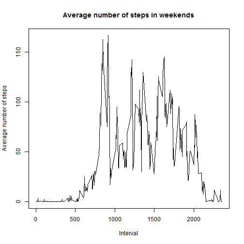
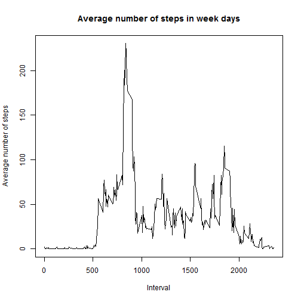

Reproducible Research
Peer Assessment 1
================

This document was created on July 19, 2014, as part of the first project in the Reproducible Research module of the Data Science Specialization.


# Loading the data
The R Script assumes that the dataset resides in the same directory as the script, and that it has been unzipped.


```r
data <- read.csv("activity.csv")
```

A histogram of the total number of steps taken each day :


```r
x <- aggregate(steps ~ date, data=data, sum)
hist(x$steps,col="orange", main="Distribution of total number of steps taken each day", xlab="Number of steps")
```

 

# What is mean and median total number of steps taken per day?
To answer this questions we're going to run the following script: 

```r
mean_steps <- mean(x$steps, na.rm=TRUE)
median_steps <- median(x$steps, na.rm=TRUE)
```

```r
mean_steps
```

```
## [1] 10766
```

```r
median_steps
```

```
## [1] 10765
```


# What is the average daily activity pattern ?
The plot below shows the average number of steps per interval :


```r
y <- aggregate(steps ~ interval, data=data, mean)
plot(y, type="l", xlab="Interval", ylab="Steps", main="Average number of steps per interval")
```

 


To find out which 5-minute interval, on average across all the days in the dataset, contains the maximum number of steps, we use :


```r
max <- y[order(y[,2],decreasing=T)[1],]
max
```

```
##     interval steps
## 104      835 206.2
```


So the 835 interval, contains the maximum number of steps, of 206.2.

# Imputing missing values
Calculate and report the total number of missing values in the dataset (i.e. the total number of rows with NAs)


```r
Missing <- sum(is.na(data$steps))
Missing
```

```
## [1] 2304
```

We'll create a new dataframe, where the missing values are replaced with the mean for their respective interval :


```r
z <- aggregate(steps~interval, data=data, mean)
data2 <- merge (data,z, by="interval", all=TRUE)
my.na <- is.na(data2$steps.x)
data2$steps.x[my.na] <- data2$steps.y[my.na]
```

A histogram for the new dataframe, where missing values have been replaced with the mean :


```r
x2 <- aggregate(steps.x ~ date, data=data2, sum)
hist(x2$steps.x,col="grey", main="Distribution of total number of steps taken each day (with imputation)", xlab="Number of steps")
```

 

To see if there are any differences for the mean and median number of steps per day after the imputation, we use :


```r
mean_steps2 <- mean(x2$steps.x)
median_steps2 <- median(x2$steps.x)
```


```r
mean_steps2
```

```
## [1] 10766
```

```r
median_steps2
```

```
## [1] 10766
```
As seen above, the differences are negligible.

# Differences in activity in weekdays and weekend

Mark the dates as week days and weekends


```r
data3 <- data2[,c(1,2,3)]
data3$day <- weekdays(as.Date(as.character(data2$date)))
data4 <- within(data3,{day[day %in% c("Monday", "Tuesday", "Wednesday","Thursday","Friday")]="weekday"
                       day[day %in% c("Saturday","Sunday")]="weekend"})
```

Plot for activity in weekends


```r
data5 <- subset(data4, day=="weekend")
x3 <- aggregate(steps.x ~ interval, data=data5, mean)
plot(x3, type="l", xlab="Interval", ylab="Average number of steps", main="Average number of steps in weekends")
```

 


Plot for activity in weekdays


```r
data6 <- subset(data4, day=="weekday")
x4 <- aggregate(steps.x ~ interval, data=data6, mean)
plot(x4, type="l", xlab="Interval", ylab="Average number of steps", main="Average number of steps in week days")
```

 

